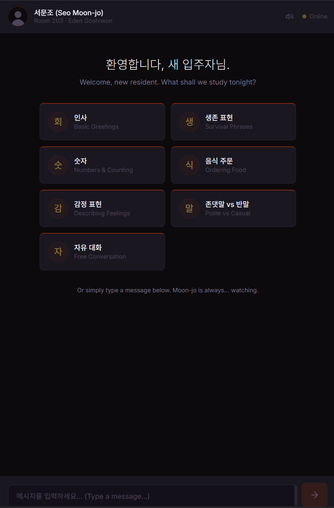

# Nunchi

**눈치** — *Learn Korean from the neighbor you never asked for.*

An AI-powered Korean language learning app where your teacher is Seo Moon-jo (서문조), the dentist from Room 203 at Eden Goshiwon. Inspired by the K-drama *Strangers from Hell* (타인은 지옥이다), Nunchi teaches vocabulary, grammar, and Korean culture through immersive, in-character conversation with a charmingly unsettling tutor. Completely free — runs on a local LLM via Ollama. No API keys needed.



## Features

- **Character-driven teaching** — Moon-jo stays in character, teaching Korean through goshiwon life, food vocabulary, and dentist metaphors
- **7 lesson topics** — Greetings, survival phrases, numbers, ordering food, feelings, polite vs casual speech, free conversation
- **Click-to-translate** — Translate any of Moon-jo's messages from Korean to English with one click
- **Text-to-speech** — Hear messages read aloud in Korean (Web Speech API, `ko-KR`)
- **Copy to clipboard** — Copy any message text instantly
- **Ambient sound design** — Subtle keyboard clicks and a low hum while Moon-jo types (Web Audio API, toggleable)
- **Dark goshiwon UI** — Deep purples, reds, and golds evoking late-night Eden Goshiwon hallways
- **Atmospheric timestamps** — Messages timestamped between 1–3 AM
- **Conversation reset** — Leave Room 203 with a farewell message
- **Rate limiting & input validation** — Security middleware with request throttling
- **113 tests** across 13 test files

## Tech Stack

| Layer | Technology |
|-------|------------|
| Framework | Next.js 16 (App Router) |
| Language | TypeScript 5.9 |
| AI | Vercel AI SDK v6 + Ollama (`qwen2.5:7b`) |
| Styling | Tailwind CSS v4 with custom theme |
| Audio | Web Audio API (ambient sounds) + Web Speech API (TTS) |
| Testing | Vitest + React Testing Library |
| Fonts | Inter + Noto Sans KR |

## Prerequisites

- **Node.js** 18+
- **Ollama** installed and running — [ollama.com](https://ollama.com)

## Quick Start

```bash
# 1. Clone the repo
git clone https://github.com/braphoggg/nunchi.git
cd nunchi

# 2. Install dependencies
npm install

# 3. Pull the LLM model (one-time, ~4.7 GB)
ollama pull qwen2.5:7b

# 4. Start Ollama (if not already running)
ollama serve

# 5. Start the dev server
npm run dev
```

Open [http://localhost:3000](http://localhost:3000). Pick a topic. Moon-jo is waiting.

## Project Structure

```
src/
├── app/
│   ├── api/
│   │   ├── chat/route.ts          # Streaming chat endpoint (Ollama)
│   │   └── translate/route.ts     # Korean → English translation
│   ├── globals.css                # Goshiwon dark theme
│   ├── layout.tsx                 # Root layout (fonts, metadata)
│   └── page.tsx                   # Home page
├── components/
│   ├── ChatContainer.tsx          # Main chat orchestrator
│   ├── ChatInput.tsx              # Auto-growing textarea input
│   ├── MessageBubble.tsx          # Message rendering + action buttons
│   ├── TopBar.tsx                 # Header (reset, mute, avatar)
│   ├── TypingIndicator.tsx        # Animated typing dots
│   └── WelcomeScreen.tsx          # Lesson topic selection
├── hooks/
│   └── useSoundEngine.ts          # Web Audio API (ambient hum, key clicks)
├── lib/
│   ├── format-message.ts          # Bold text parsing
│   ├── lesson-topics.ts           # 7 lesson topic definitions
│   ├── security.ts                # Rate limiting + input validation
│   ├── system-prompt.ts           # Moon-jo character prompt
│   └── timestamps.ts              # Atmospheric 1–3 AM timestamps
├── types/
│   └── index.ts                   # TypeScript interfaces
└── middleware.ts                   # Security headers
```

## Scripts

| Command | Description |
|---------|-------------|
| `npm run dev` | Start development server |
| `npm run build` | Production build |
| `npm run start` | Start production server |
| `npm test` | Run all tests |
| `npm run test:watch` | Run tests in watch mode |
| `npm run test:coverage` | Run tests with coverage report |
| `npm run lint` | ESLint check |

## How It Works

1. **Chat** — User sends a message → `/api/chat` streams it to Ollama (`qwen2.5:7b`) with Moon-jo's system prompt → response streams back as `UIMessage` parts
2. **Translate** — Click the globe icon on any assistant message → `/api/translate` sends the text to Ollama with a translation prompt → English translation replaces Korean text (cached, toggleable)
3. **TTS** — Click the speaker icon → browser's `SpeechSynthesisUtterance` reads the Korean text aloud at 0.9x speed
4. **Character** — A ~2KB system prompt defines Moon-jo's speech patterns (soft 존댓말, forced intimacy with 우리, goshiwon references, dentist metaphors) and teaching methodology (Hangul first, romanization, contextual examples)

## Testing

```bash
npm test
```

113 tests across 13 files covering API routes, components, hooks, and utilities. Tests use Vitest with jsdom and React Testing Library.

## License

MIT
