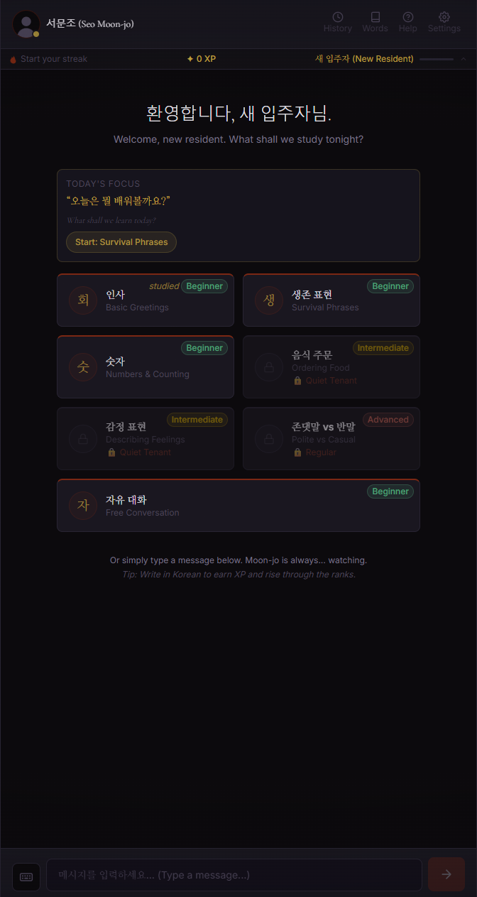

<div align="center">

# 눈치 Nunchi

**Learn Korean from the neighbor you never asked for.**

An AI-powered Korean language learning app set in a fictional goshiwon,<br>
inspired by the K-drama *Strangers from Hell* (타인은 지옥이다).



[Getting Started](#getting-started) · [Features](#features) · [How It Works](#how-it-works) · [Tech Stack](#tech-stack) · [Testing](#testing) · [Project Structure](#project-structure)

</div>

---

## The Concept

You've just moved into **Room 203** at Eden Goshiwon (에덴 고시원). Your neighbor, **Seo Moon-jo** (서문조) — the suspiciously charming dentist next door — has taken an interest in teaching you Korean. He's... *invested* in your progress.

Moon-jo teaches entirely in Korean with romanization. No English translations in his messages — you use the built-in translate button when you need help. The more Korean you write, the warmer he gets. The less you try, the colder he becomes.

Everything happens between 1 and 3 AM. The hallway lights flicker. The twins are whispering again. But you're learning Korean, and Moon-jo is always watching.

---

## Getting Started

### Prerequisites

- [Node.js](https://nodejs.org) 18+
- A [Google Gemini API key](https://aistudio.google.com/apikey) (free tier: 15 RPM, 1,000 requests/day)

### Setup

```bash
git clone https://github.com/braphoggg/Nunchi.git
cd Nunchi
npm install
```

Create `.env.local` and add your API key:

```bash
GOOGLE_GENERATIVE_AI_API_KEY=your_key_here
```

Optionally configure the Gemini model (defaults to `gemini-2.5-flash`):

```bash
GEMINI_MODEL=gemini-2.5-flash
```

Start the dev server:

```bash
npm run dev
```

Open [http://localhost:3000](http://localhost:3000). Pick a topic. Moon-jo is waiting.

The app is PWA-enabled — install it to your home screen for an app-like experience with offline vocabulary review.

---

## Features

### Conversation & Learning

- **7 structured lessons** — Greetings, Survival Phrases, Numbers & Counting, Ordering Food, Describing Feelings, Polite vs Casual speech, and Free Conversation
- **Lesson progression** — Topics are tiered by difficulty (beginner / intermediate / advanced) and locked behind rank requirements. Locked topics are visually dimmed and disabled until you reach the required rank
- **Korean-first teaching** — Moon-jo teaches in bold Korean with romanization (`**한글** (hangeul)`). No English in his messages — you discover meaning through context and the translate button
- **Error correction** — When you make mistakes, Moon-jo corrects them inline: ~~your mistake~~ → **corrected version** with brief explanations
- **Click-to-translate** — Globe icon on any message toggles between Korean and English. Translations are cached for instant switching
- **Text-to-speech** — Listen button on every assistant message reads Korean text aloud. Individual vocabulary words also have TTS playback
- **Mood system** — Moon-jo's personality adapts to your effort. Write mostly in Korean and he becomes warm, even possessive. Barely try and he turns cold and clinical
- **Daily focus** — "Today's Focus" card on the welcome screen suggests what to practice based on unvisited topics, review schedule, and your rank. Features a daily Moon-jo quote in Korean with English translation

### Vocabulary & Study

- **Click-to-save vocabulary** — Bold Korean words in Moon-jo's messages are individually clickable to save. Click a single word to save just that word, or use the batch save button to save all vocabulary from a message. Already-saved words dim automatically
- **Personal dictionary** (나의 단어장) — Save words with Korean, romanization, and English translation
- **Spaced Repetition (SRS)** — SM-2 algorithm tracks ease factor, review interval, and repetition count for every word. Due words are prioritized in study sessions
- **Flashcard study** — 3D flip cards with self-assessment (Again / Good / Easy) that feeds directly into the SRS scheduler. Shows next review date on each card
- **Listen mode** — Toggle in flashcards that hides Korean text and shows only a play button. Train your ear, then flip to check
- **Multiple-choice quizzes** — Korean → English and English → Korean MCQs generated from your saved vocabulary. 4 unique options per question (synonyms deduplicated), score summary with Moon-jo feedback
- **Batch translation** — Words missing English translations are auto-translated via the vocabulary API, with manual retry for failures
- **Unseen badge** — Notification dot shows new unsaved vocabulary

### Gamification

Earn XP, build streaks, and rise through the goshiwon ranks.

**XP Sources:**

| Action | XP |
|--------|-----|
| Send a message with Korean | 5–15 |
| Save a vocabulary word | 3 |
| Complete a flashcard session | 20 |
| Perfect flashcard session (0 Again) | +10 bonus |
| Perfect quiz (100% correct) | 25 |
| Avoid using translate (5 messages) | 8 bonus |

**5 Resident Ranks** — Dual thresholds require both XP *and* vocabulary:

| Rank | Korean | XP | Words |
|------|--------|----|-------|
| New Resident | 새 입주자 | 0 | 0 |
| Quiet Tenant | 조용한 세입자 | 100 | 10 |
| Regular | 단골 | 500 | 30 |
| Trusted Neighbor | 믿을 만한 이웃 | 1,500 | 75 |
| Floor Senior | 층 선배 | 5,000 | 150 |

- **Daily streak** — Automatic midnight reset. Moon-jo notices when you don't visit
- **Progress analytics** — SRS vocabulary breakdown (mastered / learning / new) with color-coded bar chart, Korean immersion percentage with circular progress display
- **XP toasts** — Real-time notifications when you earn points
- **Rank-up events** — Moon-jo delivers atmospheric rank-up messages in Korean when you advance
- **Progress bars** — Visual display showing both XP and word count toward next rank

### Hangul Keyboard

- **On-screen Korean keyboard** — Standard 두벌식 (Dubeolsik) layout with 4 rows
- **Real-time composition** — Jamo combine into syllables as you type (ㅎ + ㅏ + ㄴ = 한)
- **Shift for double consonants** — ㅃ, ㅉ, ㄸ, ㄲ, ㅆ and compound vowels ㅒ, ㅖ
- **Backspace decomposition** — Deleting correctly breaks syllables back into components
- **Composing preview** — Live preview of the character being built above the keyboard

### Lesson History & Search

- **Auto-save** — Conversations are saved automatically when you leave Room 203
- **Search** — Filter saved conversations by keyword with real-time results
- **Browse past lessons** — View saved conversations with date, preview text, and message count
- **Lesson review** — Read-only playback of any saved conversation
- **Storage management** — Delete old conversations to free space (max 20 saved)

### Sharing

- **Export as PNG** — Branded image with the goshiwon dark theme, bold vocabulary highlighted in gold
- **Copy as text** — Copies the full conversation to clipboard in plain-text format
- **Web Share** — Native share dialog on supported devices (mobile, etc.) with clipboard fallback

### Data & Settings

- **Data backup/restore** — Export all progress as a JSON file, import it on another device. Validated and sanitized on restore
- **Settings panel** — Theme (dark / light), font scale, reduce animations, show/hide romanization, sound volume, mute toggle
- **PWA support** — Installable progressive web app with service worker for offline static asset caching
- **Onboarding** — First-visit overlay with optional interactive tutorial that walks through every feature

### Atmosphere

- **Night progression** — The UI gradually darkens across 4 stages as the conversation grows deeper. Colors shift toward black and deep red
- **Film grain overlay** — Subtle SVG fractalNoise texture layered over the interface at low opacity with mix-blend-mode overlay, giving the UI a gritty, analog feel
- **Vignette** — Radial gradient darkening the edges of the viewport, drawing focus inward like a worn film frame
- **Cinematic typography** — Cormorant Garamond serif for Moon-jo's name, greetings, and quotes. Nanum Myeongjo Korean serif for assistant messages and flashcard prompts
- **Ambient sound** — Low 60Hz electrical hum when Moon-jo types, filtered key click sounds as you type
- **Goshiwon events** — 15 random atmospheric interruptions between messages:
  - *A sound from Room 313...*
  - *The hallway light flickers.*
  - *A shadow passes under the door.*
  - *The twins are whispering in the hallway.*
- **Atmospheric timestamps** — Every message stamped between 1–3 AM
- **Leave confirmation** — "Leave Room 203?" safety dialog before clearing the conversation

### Keyboard Shortcuts

| Key | Context | Action |
|-----|---------|--------|
| `Enter` | Chat | Send message |
| `Space` | Flashcards | Flip card |
| `1` / `2` / `3` | Flashcards (flipped) | Grade: Again / Good / Easy |
| `←` / `→` | Flashcards | Previous / next card |
| `1`–`4` | Quiz | Select answer |
| `Enter` / `Space` | Quiz (answered) | Next question |
| `Escape` | Any overlay | Close current overlay (layered) |

---

## How It Works

### Architecture

Single-page Next.js application with three API routes, all powered by Google Gemini:

| Route | Purpose | Temperature |
|-------|---------|-------------|
| `/api/chat` | Streaming conversation with Moon-jo's system prompt + mood addendum | 0.7 |
| `/api/translate` | On-demand Korean → English translation | 0.3 |
| `/api/vocabulary-translate` | Batch translate vocabulary words for the dictionary | 0.2 |

The app is a PWA with a service worker (`public/sw.js`) that uses cache-first for static assets and network-first for HTML pages.

### Moon-jo's Character

A ~2KB system prompt defines Moon-jo with strict rules:

- **Korean-only output** — Vocabulary in `**한글** (romanization)` format, never with English meanings
- **Character boundaries** — Refuses non-Korean topics, never breaks character, no emojis
- **Speech style** — Formal 존댓말 with soft endings (~거든요, ~잖아요, ~죠?), forced intimacy with "우리" (we/our)
- **Personality** — Calm, charming, possessive, perceptive. Dentist metaphors. Contempt for other residents. Asks your name, then uses it with 씨 (honorific) throughout
- **Error correction** — Inline corrections using ~~strikethrough~~ → **corrected** format with brief Korean explanations
- **Teaching method** — 3–5 new words per exchange, progressive difficulty, cultural context through goshiwon life

### Mood Engine

The mood engine analyzes the Hangul ratio across all user messages and dynamically adjusts Moon-jo's behavior:

| Korean Usage | Mood | Moon-jo's Behavior |
|-------------|------|---------------------|
| < 20% | Cold | Distant, clinical, slightly disappointed |
| 20–49% | Neutral | Baseline — polite, attentive, gently unsettling |
| 50–79% | Warm | Pleased, affectionate, more possessive |
| ≥ 80% | Impressed | Reverent, intense warmth — "You belong here" |

### Spaced Repetition

The SRS engine implements the **SM-2 algorithm**:

- **Ease factor** — Starts at 2.5, adjusts based on self-assessment quality (min 1.3)
- **Intervals** — Day 1 → Day 6 → growing by ease factor. "Again" resets to Day 1
- **Due scheduling** — Words due for review are shuffled to the front of flashcard sessions
- **Grade mapping** — Again (quality 1), Good (quality 3), Easy (quality 5)

SRS state is stored on each vocabulary item and persists across sessions.

### Hangul Composition Engine

The keyboard uses a state machine implementing the standard Korean syllable formula:

```
Syllable = 0xAC00 + (initial × 21 + medial) × 28 + final
```

Supports 19 initial consonants, 21 medial vowels, 28 final positions (including empty), complex vowel combinations (ㅗ + ㅏ = ㅘ), complex final consonants (ㄱ + ㅅ = ㄳ), and correct decomposition on backspace.

### Data Persistence

All progress stays in your browser's localStorage:

| Key | Contents | Limit |
|-----|----------|-------|
| `nunchi-gamification` | XP, streaks, session stats | 500 KB |
| `nunchi-vocabulary` | Saved words + SRS state | 1 MB / 5,000 words |
| `nunchi-lesson-history` | Saved conversations | 20 conversations |
| `nunchi-settings` | Theme, font scale, romanization, animations | — |
| `nunchi-visited-topics` | Which lessons have been started | — |
| `nunchi-tutorial-completed` | Tutorial completion flag | — |
| `nunchi-onboarded` | Onboarding completion flag | — |
| `nunchi-sound-muted` | Sound mute state | — |
| `nunchi-sound-volume` | Sound volume level | — |

Corrupted data auto-resets to safe defaults. XP has anti-tampering validation (max events per minute, max amount per event, total ceiling). Data backup/restore exports all 9 keys as validated JSON.

### Security

- **Rate limiting** — 10 requests/minute per IP on all API routes
- **Input validation** — Message count (≤50), content length (≤2,000 chars), role validation
- **Content sanitization** — HTML tags stripped, control characters removed, null byte filtering
- **Anti-tampering** — XP history validated for burst rate, max amounts, and total ceiling (999,999)
- **Backup validation** — Imported data checked for valid structure, only known keys are restored
- **Security headers** — `X-Content-Type-Options: nosniff`, `X-Frame-Options: DENY`, `X-XSS-Protection`, `Referrer-Policy`

---

## Tech Stack

| Layer | Technology |
|-------|-----------|
| Framework | [Next.js 16](https://nextjs.org) (App Router) |
| Language | TypeScript 5.9 (strict mode) |
| UI | [React 19](https://react.dev) |
| AI | [Vercel AI SDK v6](https://sdk.vercel.ai) + [Google Gemini 2.5 Flash](https://deepmind.google/technologies/gemini/) |
| Styling | [Tailwind CSS v4](https://tailwindcss.com) with custom goshiwon theme |
| Image Export | [html-to-image](https://github.com/bubkoo/html-to-image) |
| Audio | Web Audio API + Web Speech API |
| PWA | Service Worker + Web App Manifest |
| Testing | [Vitest](https://vitest.dev) + [React Testing Library](https://testing-library.com) |
| Fonts | Inter + Cormorant Garamond + Nanum Myeongjo (Google Fonts) |

### Theme

Custom dark palette defined in Tailwind v4 (with a warm-parchment light mode):

| Token | Hex | Usage |
|-------|-----|-------|
| `goshiwon-bg` | `#0c0a0d` | Background |
| `goshiwon-surface` | `#1a1720` | Cards, panels |
| `goshiwon-accent` | `#8b1a1a` | Dark red accents |
| `goshiwon-yellow` | `#d4a843` | Vocabulary highlights, gold text |
| `goshiwon-text` | `#e8e4ec` | Primary text |
| `goshiwon-border` | `#2a2533` | Borders, dividers |

Three font layers — Inter (UI body), Cormorant Garamond (serif display for headers and quotes), and Nanum Myeongjo (Korean serif for assistant messages and flashcards). 12+ CSS animations including message fade-in, flashcard 3D flip, keyboard slide-up, night color transitions, XP toast popups, and rank-up glow effects.

---

## Testing

```bash
npm test              # run all tests
npm run test:watch    # watch mode
npm run test:coverage # coverage report
```

**764 tests** across 55 test files covering:

- **API routes** — Chat streaming, translation, vocabulary batch, error handling, rate limiting
- **Components** — All UI components including overlays, message rendering, input handling
- **Hooks** — Gamification state, vocabulary management, flashcards, SRS integration, sound engine, night progression, goshiwon events, settings persistence, tutorial state machine
- **Libraries** — Hangul composition/decomposition, vocabulary parsing, mood calculation, XP/rank logic, SRS algorithm, quiz generation, daily planner, data backup/restore, security validation, timestamps, message formatting, tutorial steps data integrity
- **Edge cases** — Race conditions, localStorage corruption, streak midnight rollover, anti-tampering detection, SRS interval boundaries, locked topic enforcement, quiz option deduplication

Tests run with Vitest in a jsdom environment with React Testing Library. TypeScript strict mode enforced.

---

## Project Structure

```
src/
├── app/
│   ├── api/
│   │   ├── chat/                  # Streaming chat (Gemini 2.5 Flash)
│   │   ├── translate/             # Korean → English translation
│   │   └── vocabulary-translate/  # Batch vocabulary translation
│   ├── globals.css                # Goshiwon theme + atmospheric overlays + 12 animations
│   ├── layout.tsx                 # Root layout, fonts, metadata, PWA tags
│   ├── manifest.ts                # PWA web app manifest
│   └── page.tsx                   # Home → ChatContainer
├── components/
│   ├── ChatContainer.tsx          # Main orchestrator (hooks, overlays, state)
│   ├── ChatInput.tsx              # Auto-growing textarea
│   ├── MessageBubble.tsx          # Messages + translate/copy/listen/save actions
│   ├── TopBar.tsx                 # Header bar + all action buttons
│   ├── WelcomeScreen.tsx          # Lesson topics + daily focus + difficulty badges
│   ├── StatsBar.tsx               # Compact XP / streak / rank display
│   ├── StatsPanel.tsx             # Detailed stats + SRS breakdown + immersion chart
│   ├── VocabularyPanel.tsx        # Saved words list (나의 단어장)
│   ├── FlashcardMode.tsx          # Flashcard study + listen mode + SRS grading
│   ├── QuizMode.tsx               # Multiple-choice quiz interface
│   ├── HangulKeyboard.tsx         # On-screen Korean keyboard
│   ├── LessonHistory.tsx          # Browse + search saved conversations
│   ├── LessonReview.tsx           # Read-only conversation replay
│   ├── SettingsPanel.tsx          # Theme, font, romanization, sound, data backup
│   ├── ShareButton.tsx            # Export as PNG / text / Web Share
│   ├── HelpModal.tsx              # Comprehensive feature guide
│   ├── OnboardingOverlay.tsx      # First-visit welcome overlay
│   ├── TutorialOverlay.tsx        # Interactive step-by-step tutorial
│   ├── GoshiwonEventBubble.tsx    # Atmospheric event notifications
│   ├── XPToast.tsx                # XP gain popup
│   └── TypingIndicator.tsx        # Animated typing dots
├── hooks/
│   ├── useGamification.ts         # XP, streaks, ranks, stats, quiz rewards
│   ├── useVocabulary.ts           # Word management + SRS migration + localStorage
│   ├── useFlashcards.ts           # Study session state machine + SRS ordering
│   ├── useSettings.ts             # Theme, font scale, romanization, animations
│   ├── useTutorial.ts             # Interactive tutorial state machine
│   ├── useSoundEngine.ts          # Ambient hum + key click synthesis
│   ├── useGoshiwonEvents.ts       # Random atmospheric interruptions
│   ├── useNightProgression.ts     # UI darkening over conversation length
│   └── useLessonHistory.ts        # Conversation save/load/delete
├── lib/
│   ├── system-prompt.ts           # Moon-jo's 2KB character definition
│   ├── gamification.ts            # XP values, 5 rank definitions
│   ├── srs.ts                     # SM-2 spaced repetition algorithm
│   ├── quiz-generator.ts          # Multiple-choice question generator
│   ├── daily-planner.ts           # Today's Focus suggestions + daily quotes
│   ├── data-backup.ts             # JSON export/import for all app data
│   ├── hangul-compose.ts          # Jamo → syllable composition engine
│   ├── mood-engine.ts             # Hangul ratio → mood level
│   ├── parse-vocabulary.ts        # Extract vocab from bold patterns
│   ├── lesson-topics.ts           # 7 lessons with difficulty tiers + rank gates
│   ├── format-message.ts          # Tokenizer for bold/strikethrough/arrow rendering
│   ├── goshiwon-events.ts         # 15 atmospheric event descriptions
│   ├── security.ts                # Rate limiting, validation, sanitization
│   ├── ai-model.ts                # Configurable Gemini model loader
│   ├── tutorial-steps.ts          # Tutorial step definitions
│   ├── timestamps.ts              # 1–3 AM timestamp generator
│   └── message-utils.ts           # UIMessage text extraction
├── types/
│   └── index.ts                   # All TypeScript interfaces
└── middleware.ts                   # Security headers for API routes

public/
├── sw.js                          # Service worker (offline caching)
└── icon.svg                       # PWA app icon
```

---

## Scripts

| Command | Description |
|---------|-------------|
| `npm run dev` | Start development server |
| `npm run build` | Production build |
| `npm run start` | Start production server |
| `npm test` | Run all 764 tests |
| `npm run test:watch` | Tests in watch mode |
| `npm run test:coverage` | Tests with coverage report |
| `npm run lint` | ESLint check |

---

## License

MIT

---

<div align="center">

*"You don't have to stay... but you want to, don't you?"*<br>
— Seo Moon-jo, Room 203

</div>
